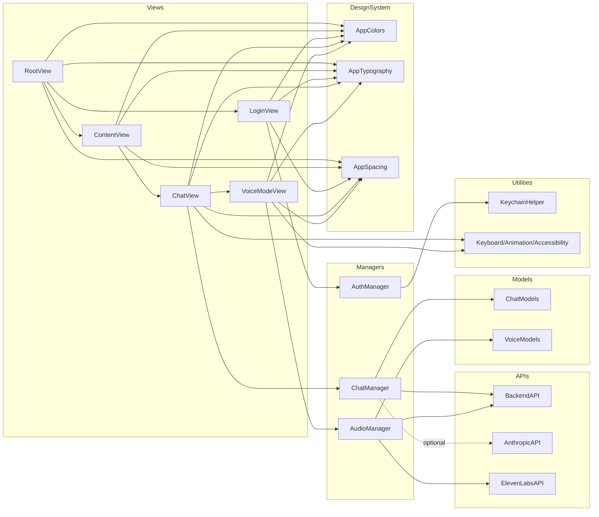
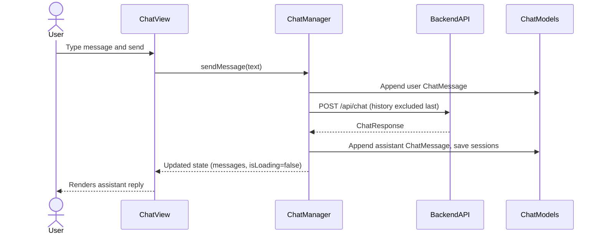
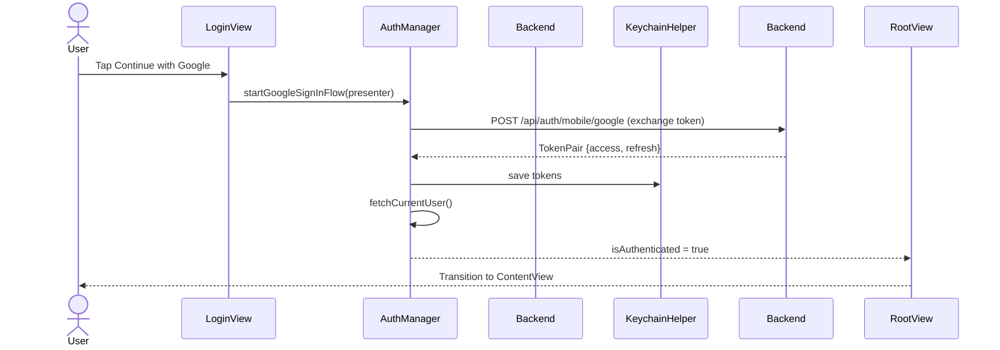

## iOS Architecture — ComprehensionEngine

This document provides a high-level architecture overview of the iOS app located in `ComprehensionEngine/`.

### What it is
- **SwiftUI app** with a clean separation between Views, Managers (state/controllers), API clients, Models, and a small Design System.
- **ObservableObject singletons** (`AuthManager`, `ChatManager`, `AudioManager`) injected as `@EnvironmentObject`s drive app state and user flows.
- **Backend-first design** with graceful fallbacks: chat via `BackendAPI` (and optional Claude direct client), TTS via backend or direct ElevenLabs, sessions via backend or local `UserDefaults`.

### Directory map (key areas)
```
ComprehensionEngine/
└─ ComprehensionEngine/
   ├─ API/                  # Network clients
   │  ├─ BackendAPI.swift
   │  ├─ AnthropicAPI.swift
   │  └─ ElevenLabsAPI.swift
   ├─ Managers/             # App state and orchestration
   │  ├─ AuthManager.swift
   │  ├─ ChatManager.swift
   │  └─ AudioManager.swift
   ├─ Models/               # Chat + Voice models and DTOs
   │  ├─ ChatModels.swift
   │  └─ VoiceModels.swift
   ├─ Views/                # SwiftUI screens and components
   │  ├─ RootView.swift, ContentView.swift
   │  ├─ LoginView.swift
   │  ├─ ChatView.swift (+ ChatInputView, ChatHistoryView, Shared/*)
   │  └─ VoiceModeView.swift (+ Shared/VoiceModeOverlay.swift)
   ├─ Styles/               # Design system
   │  ├─ ColorScheme.swift (AppColors)
   │  ├─ Typography.swift (AppTypography)
   │  └─ Spacing.swift (AppSpacing)
   ├─ Utilities/            # Platform helpers
   │  ├─ KeychainHelper.swift
   │  ├─ KeyboardManager.swift, AnimationManager.swift, AccessibilityManager.swift
   │  
   ├─ ComprehensionEngineApp.swift  # App entry
   └─ Info.plist                     # Runtime configuration
```

### Component map


### App lifecycle and navigation
- `ComprehensionEngineApp`: Entry point. Injects environment objects: `AudioManager.shared`, `ChatManager.shared`, `AuthManager.shared`.
- `RootView`: Decides between `LoginView` and `ContentView` using `REQUIRE_LOGIN` from `Info.plist` and `AuthManager.isAuthenticated`.
- `ContentView`: Hosts the main `ChatView`.

### State management
- Managers are `ObservableObject` singletons:
  - **`AuthManager`**: Google Sign-In flow, token exchange/refresh, `UserProfile` fetch, Keychain persistence (`ce.access_token`, `ce.refresh_token`).
  - **`ChatManager`**: Message list, sessions, sending chat messages via `BackendAPI`, backend session discovery with fallback to local `UserDefaults`.
  - **`AudioManager`**: Microphone recording with `AVAudioEngine` + `SFSpeechRecognizer`, input level metering for UI, TTS playback via backend or direct ElevenLabs, and system TTS fallback.

### Data flows

#### Text chat request/response


#### Voice mode (STT + Chat + TTS)
```mermaid
sequenceDiagram
  actor User
  participant VoiceModeView
  participant AudioManager
  participant ChatManager
  participant BackendAPI
  participant ElevenLabsAPI

  User->>VoiceModeView: Open voice mode
  VoiceModeView->>AudioManager: startRecording()
  AudioManager-->>VoiceModeView: transcription updates (+inputLevel)
  User->>VoiceModeView: Tap send
  VoiceModeView->>AudioManager: stopRecording() + finalizeTranscription()
  VoiceModeView->>ChatManager: sendMessage(transcript)
  ChatManager->>BackendAPI: POST /api/chat
  BackendAPI-->>ChatManager: ChatResponse
  alt Backend TTS available
    VoiceModeView->>AudioManager: speakWithElevenLabs via BackendAPI /api/tts
  else Direct ElevenLabs
    VoiceModeView->>AudioManager: ElevenLabsAPI.generateSpeech()
  end
  AudioManager-->>User: Play audio; optional auto-resume recording
```

#### Authentication (Google Sign-In)


### Key files and responsibilities
- **App entry**: `ComprehensionEngineApp.swift` creates the window and injects managers.
- **Navigation**: `RootView.swift` toggles `LoginView` vs `ContentView` with motion-aware transitions.
- **Chat UI**: `ChatView.swift` renders messages (`ModernChatMessageView`), pinned input, history sheet, settings sheet; scrolls on updates.
- **Voice UI**: `VoiceModeView.swift` provides recording, visualization (`VoiceWaveformView`), and a single primary control; overlay handled by `Shared/VoiceModeOverlay.swift`.
- **Auth**: `AuthManager.swift` integrates Google Sign-In (via `canImport(GoogleSignIn)`), token exchange/refresh, and profile fetch.
- **Chat**: `ChatManager.swift` sends messages, maintains sessions, pulls previews/full history from backend (`/api/conversations`, `/turns`).
- **Audio/TTS**: `AudioManager.swift` wraps STT (`SFSpeechRecognizer`) and TTS (backend `/api/tts` or direct `ElevenLabsAPI`).
- **Networking**: `BackendAPI.swift` centralizes base URL resolution, auth header injection (Keychain token preferred), retries on 401 by forcing refresh, and typed DTOs.
- **Design system**: `Styles/ColorScheme.swift`, `Styles/Typography.swift`, `Styles/Spacing.swift` standardize colors, text styles, spacing, and shadows.
- **Models**: `Models/ChatModels.swift` and `Models/VoiceModels.swift` define app models (messages, sessions, voices, settings) and DTOs.
- **Persistence**: `Utilities/KeychainHelper.swift` for secure tokens; `UserDefaults` used as local fallback for sessions.

### Configuration and runtime behavior
- **`Info.plist` keys**:
  - `BACKEND_BASE_URL`: e.g., `http://192.168.1.202:8000` (simulator uses `127.0.0.1` as a default in debug when unset).
  - `REQUIRE_LOGIN`: gates login requirement in `RootView`.
  - `GIDClientID`: Google Sign-In client ID and URL scheme.
- **Auth header resolution** in `BackendAPI`:
  - Prefer `Authorization: Bearer <Keychain token>` from `AuthManager`.
  - Else optional `x-api-key` or `Authorization` from `Info.plist`/env.
- **Fallbacks**:
  - Chat sessions: backend summaries/turns if configured; else local `UserDefaults`.
  - TTS: backend `/api/tts` if reachable; else direct `ElevenLabsAPI`; else system TTS.
  - Host switching: automatic `localhost` ↔ `127.0.0.1` alternate retry for simulator/dev.

### Error handling (representative)
- `BackendAPI.APIError`, `AuthManager.AuthError`, `ChatManager.ChatError`, `AudioManager.AudioError` provide user-meaningful descriptions.
- `BackendAPI` retries after 401 using `AuthManager.forceRefresh()` and replays the request.

### Extensibility notes
- **Models**: `AIModel` enum supports adding/removing model IDs without widespread changes.
- **APIs**: Add endpoints in `BackendAPI`; existing auth header and retry logic apply automatically.
- **Voice**: Swap TTS provider by updating `AudioManager.speakWithElevenLabs` strategy; visualization is additive via `VoiceWaveformView`.
- **Design**: Centralized colors/typography/spacing allow easy theme updates.

### Performance and accessibility
- Scroll performance: `LazyVStack` + anchor scrolling; input pinned via `safeAreaInset` to avoid heavy keyboard observers.
- Accessibility: Reduced-motion transitions, semantic colors/typography helpers in Styles, and managers for keyboard/accessibility are available.

### Quick file reference
- `ComprehensionEngineApp.swift`, `RootView.swift`, `ContentView.swift`
- `Views/ChatView.swift`, `Views/LoginView.swift`, `Views/VoiceModeView.swift`, `Views/Shared/VoiceModeOverlay.swift`
- `Managers/AuthManager.swift`, `Managers/ChatManager.swift`, `Managers/AudioManager.swift`
- `API/BackendAPI.swift`, `API/AnthropicAPI.swift`, `API/ElevenLabsAPI.swift`
- `Models/ChatModels.swift`, `Models/VoiceModels.swift`
- `Styles/ColorScheme.swift`, `Styles/Typography.swift`, `Styles/Spacing.swift`
- `Utilities/KeychainHelper.swift`


